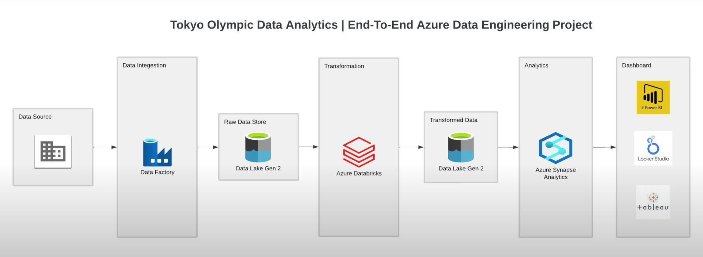

# Olympic Data Analytics

## Introduction 
Streamlined data ingestion and transformation using Azure Data Factory, Azure Databricks, and Spark, enabling efficient data loading into Azure Data Lake Storage, and facilitating large-scale data transformation.

Empowered data analysis and visualization through Azure Synapse Analytics, enabling SQL querying of transformed data and insightful visualizations with Tableau.

## Architecture 

## Technology Used
- Programming Language - Python
- Microsoft Azure (AWS)
1. Azure Data Factory
2. Azure Data Lake
3. Azure Databricks
4. Azure Synapse
5. Tableau
